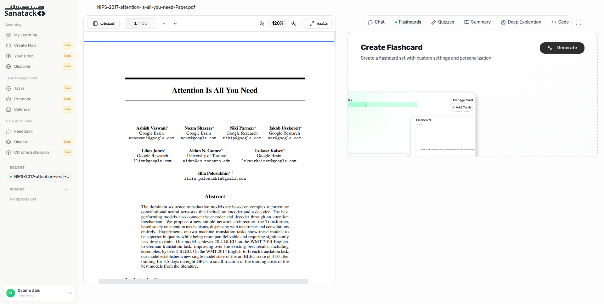

# Sanatack Frontend

<p align="center">
  
</p>

<p align="center">
  The main frontend for <strong>Sanatack</strong>, an AI-powered learning platform that helps learners turn documents and videos into interactive study workspaces.
</p>

<p align="center">
  
</p>

## Overview

Sanatack was built as an AI-first study experience for students and self-learners. The platform combines a polished landing page, authentication flows, pricing screens, and an in-product learning workspace where users can upload material, organize it into spaces, and study it through AI-assisted tools.

This repository contains the main React + Vite frontend for that experience.

## What The Platform Showcased

- AI chat for asking questions about study material
- AI-generated quizzes for active recall
- Flashcards for spaced review
- Smart summaries for fast lesson digestion
- Deep explanations for harder concepts
- PDF and video-based learning playgrounds
- Workspace and space organization for ongoing study
- Bilingual product experience with Arabic and English UI
- Marketing landing page, pricing, FAQs, and onboarding flows

## Product Screens

### Learning Dashboard

<p align="center">
  
  
</p>

### Learning Workspace

<p align="center">
  
</p>

The workspace experience was designed to let learners read source material on one side and generate study outputs like chat, flashcards, quizzes, summaries, and explanations on the other.

## Landing Page Highlights

The landing page positioned Sanatack as an AI tutor for faster learning, with feature sections for:

- Smart chat
- Interactive quizzes
- Learning flashcards
- Smart summaries
- Deep explanation
- Pricing and plan comparison
- FAQ and conversion-focused calls to action

## Demo Assets

The repository also includes demo assets used in the landing page and product showcase:

- `src/assets/demo/newhome.png`
- `src/assets/demo/newhomeDark.png`
- `src/assets/DemoScreenShot.png`
- `src/assets/demo/gifs/deep.mp4`
- `src/assets/demo/gifs/flashcard.mp4`
- `src/assets/demo/gifs/quiz.mp4`
- `src/assets/demo/gifs/summry.mp4`

## Tech Stack

- React 18
- TypeScript
- Vite
- Tailwind CSS
- Radix UI
- Framer Motion
- GSAP
- Firebase
- React Router
- i18next

## Getting Started

### Prerequisites

- Node.js
- pnpm or npm

### Install

```bash
pnpm install
```

### Run The App

```bash
pnpm dev
```

### Build

```bash
pnpm build
```

## Environment

Create a local `.env` file for development. A safe template is available in `.env.example`.

Typical variables used by the frontend include:

- Firebase configuration
- `VITE_REACT_APP_BASEURL`
- `VITE_BASE_URL`
- `VITE_YOUTUBE_API_KEY`
- `VITE_MOYASAR_ACCESS_KEY`
- `VITE_UNSPLASH_ACCESS_KEY`

## Repository Context

This repository is the main frontend for the Sanatack platform and is separate from the backend/services codebase. If you are looking for the broader public project release, see the archived startup repository at [Eslamzaid/sanatack-startup](https://github.com/Eslamzaid/sanatack-startup.git).

## Contributors

Based on the repository commit history, contributors include:

- `sanatack-org`
- `Eslam Zaid`
- `Abdulmajeed Ali Al-Hazemi`
- `Mariam Aslan`
- `Nor Alshaar`
- `srosama`

## Notes

- This repo contains the frontend application and product assets.
- Some product integrations require environment variables and backend services to run fully.
- Demo images in this README are pulled from the repository assets so the project can be showcased directly on GitHub.